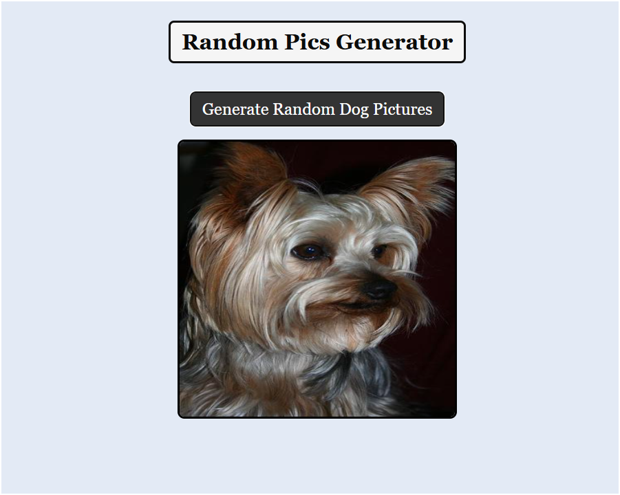

# Random Pic Generator

A simple web application that generates random pictures each time a button is clicked. This project demonstrates basic web development skills using HTML, CSS, and JavaScript.

## Features

- Generate random pictures at the click of a button
- Responsive design for mobile and desktop
- Simple and clean user interface

## Demo

You can see the live demo of the Random Pic Generator [here](https://hardik-techie.github.io/Random-Pic-Generator/).

## Technologies Used

- HTML
- CSS
- JavaScript

---
